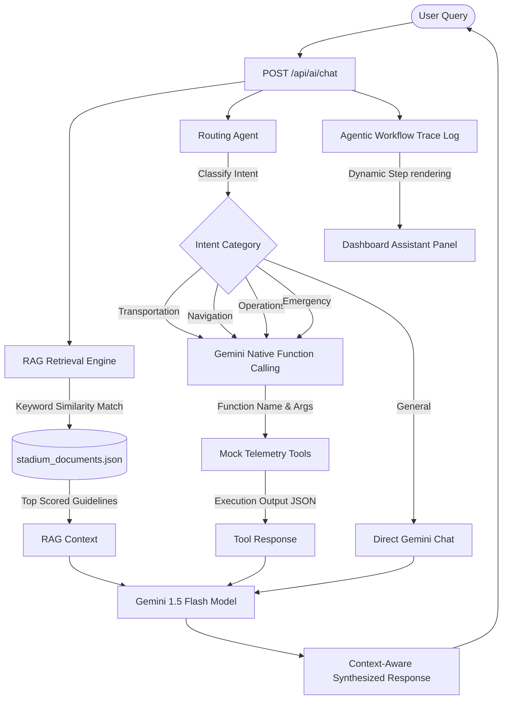

# ⚽ StadiumIQ — GenAI Smart Stadium Operations | FIFA World Cup 2026

[](https://www.fifa.com/)
[](https://expressjs.com/)
[](https://aistudio.google.com/)
[](https://developer.mozilla.org/en-US/docs/Web/CSS)
[](#-3-retrieval-augmented-generation-rag-pipeline)

StadiumIQ is a GenAI-enabled smart stadium operations and fan experience platform designed for the **FIFA World Cup 2026** at NRG Stadium. The system integrates real-time IoT simulated telemetry, interactive indoor accessibility floor plans, and Google Gemini AI models to orchestrate crowd intelligence, spatial navigation, transit hubs, and sustainability.

---

## 📐 System Architecture

StadiumIQ runs on a sophisticated **Agentic Multi-Agent & RAG Workflow**. The following diagram illustrates how user queries are processed, routed, enriched, and answered:



---

## 👥 Role-Based Feature Matrix

The platform dynamically adapts its capabilities based on the active user role:

### 🎫 Fan Experience Features
*   **Multilingual AI Assistant**: Instant translation and support across 8 core languages (English, Spanish, French, Arabic, Portuguese, Chinese, Hindi, German) and up to 32 languages in total.
*   **RAG Spectator Policies**: Instantly query official stadium guidelines, ticketing policies, and prohibited items (e.g., clearance sizes for clear bags, camera lens limits, and umbrella bans).
*   **Smart Indoor Navigation**: Map routes across Ground Level, Concourse Level 1, Lower Bowl Level 2, and Upper Bowl Level 3.
*   **♿ Accessibility Filtering**: Filter spatial routes to prioritize wheelchair-accessible ramps, elevators, and sensory rooms.
*   **Multimodal Transport Hub**: Estimate travel times under active match-day congestion and view transit capacity loads (METRORail, shuttles, rideshares).
*   **Eco-Carbon Timeline**: Dynamic, fully animated CSS-based carbon emission tracking with hover tooltips displaying hourly green footprints.

### 📋 Staff & Operations Features
*   **Crowd Intelligence Alerts**: Live sensor-driven dashboard showing zone density levels (Low, Medium, High, Critical) with automatic bottleneck warnings.
*   **Incident Ticketing Log**: Real-time operational ticket dispatcher. Displays active medical, safety, and operational alerts with AI-generated tactical mitigations.
*   **Volunteer Task Dispatcher**: Enables organizers to select sectors, specify tasks (e.g., crowd redirection, medical escort), draft instruction cards via Gemini, edit details on the fly, and deploy to field staff instantly.
*   **Agentic Execution Log**: A dedicated, real-time frontend trace panel showing exactly how the AI classifies intents, references RAG sources, and triggers backend tools.

---

## 📂 Project Directory Structure

```
c4/
├── index.html                   # Core web layout (Semantic HTML5, fully accessible)
├── styles.css                   # Premium CSS design system (Cyber-sports theme, dark mode, responsive)
├── app.js                       # Main frontend controller (Routing, navigation, live backend connection check)
├── README.md                    # This documentation file for GitHub
├── js/                          # Frontend Modular JavaScript Layer
│   ├── api.js                   # API Client handling fetch requests to the local Express server
│   ├── assistant.js             # Chat interface logic for Google Gemini-powered bot
│   ├── crowd.js                 # Heatmap render, live alerts feed, and crowd mitigations
│   ├── navigation.js            # Indoor maps, floor selection, and pathfinding routing
│   ├── transport.js             # Shuttle timetables, parking garages, and travel time estimator
│   ├── sustainability.js        # Energy utilization, waste recyclers, and carbon emission graphs
│   ├── operations.js            # Volunteer dispatcher and incident logs UI controller
│   └── utils.js                 # Shared tools (animated counters, toast notices, HTML cleaners)
└── backend/                     # Backend API & Simulation Layer (Node.js & Express)
    ├── package.json             # Service metadata and dependencies
    ├── server.js                # Express app config (CORS settings, Helmet security, Rate limits)
    ├── .env.example             # Template for local environment parameters
    ├── .env                     # Local configuration parameters (API keys)
    ├── data/
    │   └── stadium_documents.json # RAG spectator guidelines & stadium coordinate data
    └── routes/                  # Express Sub-routers (API Endpoints)
        ├── ai.js                # AI module routing requests directly to the Gemini SDK
        ├── crowd.js             # Simulates real-time stadium density sensors
        ├── navigation.js        # Simulates indoor path structures and accessibility features
        ├── transport.js         # Coordinates shuttle, rail, and vehicle routes
        ├── sustainability.js    # Logs solar, energy, and water KPIs
        └── operations.js        # Stores staff timelines and incident ticketing data
```

---

## 🛠️ Installation & Quick Start

Follow these steps to run the StadiumIQ full-stack project locally:

### Prerequisites
*   [Node.js](https://nodejs.org/) (v18.0.0 or higher recommended)
*   NPM (installed automatically with Node.js)
*   A Gemini API key (Obtainable from [Google AI Studio](https://aistudio.google.com/))

### 1. Set Up the Backend
1.  Navigate to the backend directory:
    ```bash
    cd backend
    ```
2.  Install dependencies:
    ```bash
    npm install
    ```
3.  Create your local `.env` file:
    ```bash
    copy .env.example .env
    ```
4.  Open `.env` and plug in your Gemini API Key:
    ```env
    GEMINI_API_KEY=AIzaSyYourGeminiAPIKeyGoesHere
    PORT=3001
    CORS_ORIGIN=http://localhost:5500
    ```
5.  Start the server:
    ```bash
    npm start
    ```
    The server will run on `http://localhost:3001`. If no API Key is specified, it runs in **Demo Mode (Fallback)**.

### 2. Set Up the Frontend
1.  Open a new terminal at the project root (`c4`).
2.  Launch a simple HTTP development server. For example:
    ```bash
    npx -y serve -l 5500
    ```
3.  Open your browser and navigate to:
    `http://localhost:5500`

---

## 🛡️ Security & Performance
*   **Security Headers**: [Helmet.js](https://helmetjs.github.io/) integration blocks script-injection vulnerabilities.
*   **CORS Protection**: Access is restricted strictly to designated frontend locations.
*   **Rate Limiter**: Safeguards the API routes from potential request overloading.
*   **XSS Protection**: Secure DOM manipulation (`textContent` injection) is used exclusively for dynamic elements.
*   **Demo Mode Resilience**: If the Gemini API key is missing or quota limits are exceeded, the local fallback classifier simulates intent-matching and returns rich RAG database responses.
